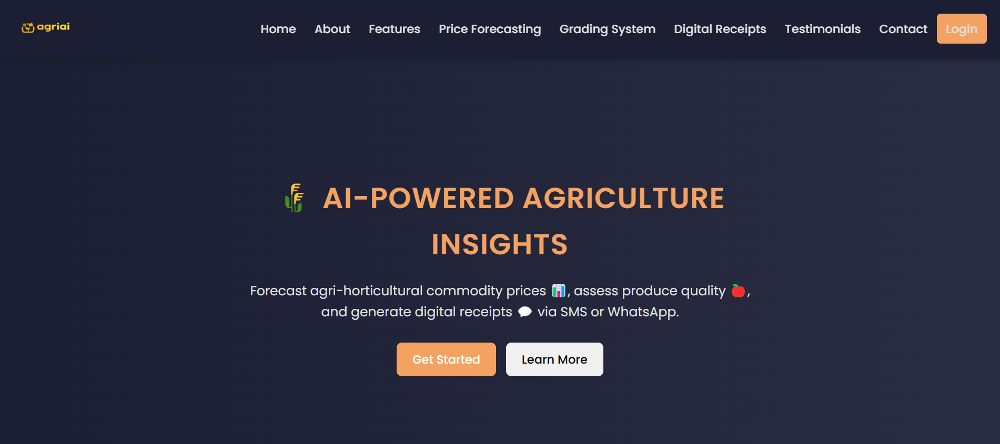
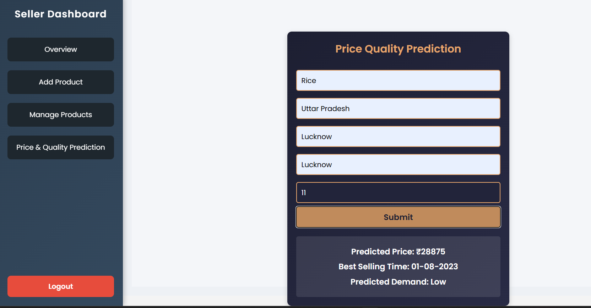
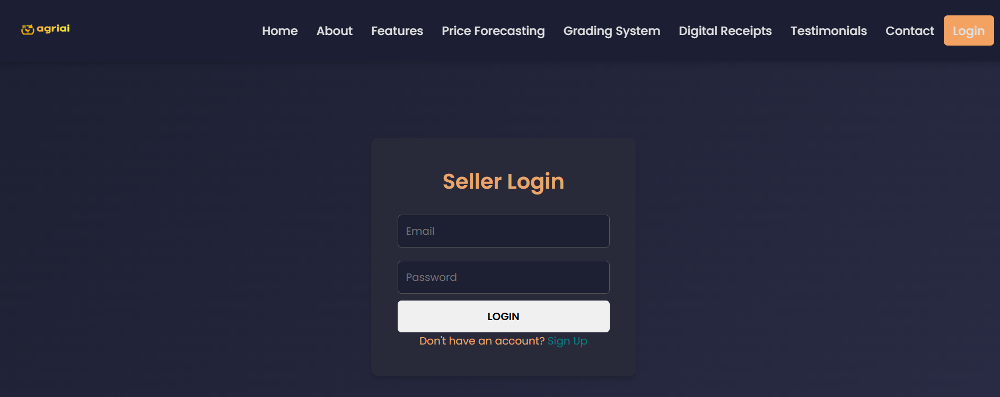
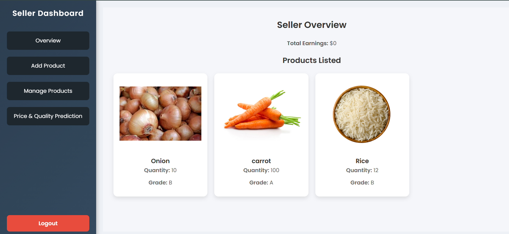

# Agri-Market 🌾 — Powered by MERN Stack and AI



## 🌱 Problem Statement: Smart Agriculture

Develop an AI-powered tool that integrates predictive analytics to **forecast prices of agri-horticultural commodities** (such as pulses, onions, and potatoes) based on **market trends and weather conditions**. Additionally, the tool implements a **grading system to assess the freshness and quality** of fruits and vegetables, enhancing decision-making for sellers and buyers. Furthermore, the tool **generates and sends digital receipts via SMS or WhatsApp** to their customers.

---

## 🚀 Features

- 📈 **Price Forecasting**: Uses AI models to predict upcoming prices of agri-horticultural commodities.
- 🌦️ **Weather-Based Analysis**: Integrates weather data to refine forecasting.
- 🍕 **Quality Grading System**: Image-based AI system to grade freshness and quality of produce.
- 🗾 **Digital Receipt Generation**: Instantly generate and share digital receipts through SMS/WhatsApp.
- 📊 **Seller Dashboard**: View sales, forecasts, product grades, and customer communication.
- 🌐 **Multilingual UI**: Support for local languages to ensure usability for rural farmers and vendors.

---

## 🛠️ Tech Stack

### 💻 Frontend
- React.js
- Tailwind CSS
- Axios
- Google Translate API (for multilingual support)

### 🧠 AI & Backend
- Node.js + Express.js
- Python Flask (AI Microservices for price forecasting & quality grading)
- MongoDB (NoSQL Database)
- Twilio API / WhatsApp Business API (for SMS & messaging)

---

## 🧠 AI Modules

1. **Price Prediction Model**:  
   - Inputs: Historical market prices, crop type, location, weather conditions  
   - Output: Future price trends

2. **Quality Grading Model**:  
   - Inputs: Image of fruit/vegetable  
   - Output: Grade (A/B/C) + freshness level

3. **Receipt Generator**:  
   - Auto-generates transaction receipts  
   - Sends to buyer via SMS/WhatsApp in local language

---

## 📸 Screenshots

### 🖼️ 1. AI-Based Price Forecast Visualization


### 🖼️ 2


### 🖼️ 3. Seller Dashboard with Analytics



---

## 🧪 Setup Instructions

```bash
# Clone the repository
git clone https://github.com/yourusername/agri-market.git
cd agri-market

# Install frontend dependencies
cd client
npm install

# Install backend dependencies
cd ../server
npm install

# Run MongoDB locally or configure Atlas

# Start backend
npm start

# Start frontend
cd ../client
npm start
```

For the AI models:
```bash
# Navigate to the AI service folder
cd ../ai-models

# Create a virtual environment and install requirements
python -m venv venv
source venv/bin/activate
pip install -r requirements.txt

# Run the Flask app
python app.py
```

---


